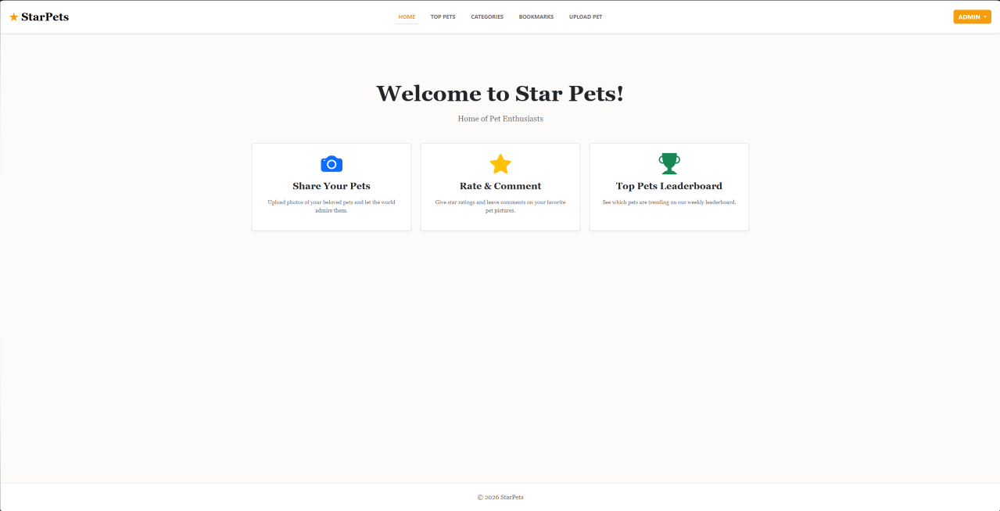
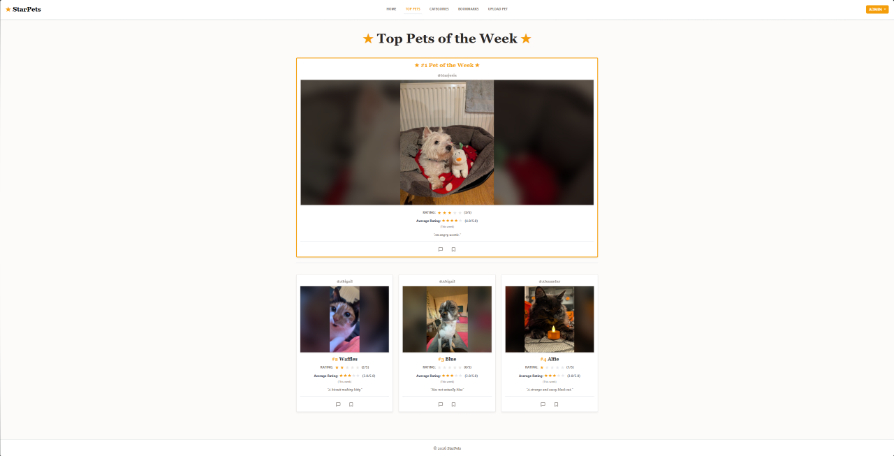
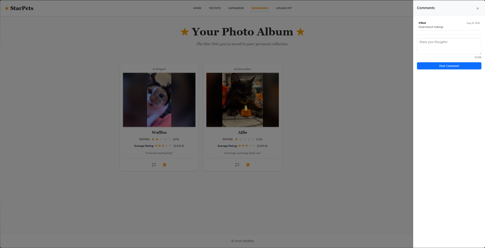

# ⭐🐾 StarPets
[]

A Django-based photo-sharing platform where users can upload, rate, and comment on pets. Built for pet lovers to discover and share high-quality pet profiles with a community-driven trending leaderboard.




## 🛠️ Engineering Highlights

Rather than just adding features, the recent solo development phases focused on resolving critical technical debt:

* **Performance (Image Processing):** Eliminated unnecessary image re-encoding on rating clicks. This reduced processing time from 10.2 ms to 1.9 ms and stopped the server from mutating file bytes, preventing clients from constantly re-downloading the same photos.
* **Database Optimization (N+1 Fix):** Eliminated an N+1 performance defect that caused database queries to scale linearly with row count on the feed. Verified and pinned via `test_annotations.py`.
* **Security (XSS Patch):** Resolved a stored XSS vulnerability in the comment rendering system by completely rebuilding the DOM instead of interpolating raw HTML strings.
* **Complex ORM Logic:** Refactored the leaderboard to use conditional aggregation over a 7-day rolling window, preventing unrated or newly uploaded pets from hijacking the top spots.
* **Deployment Hardening:** Implemented a fail-closed `SECRET_KEY` guard and HTTPS-only cookies in production, while preserving a frictionless fallback for local development.

## 📖 Project Background & Attribution

StarPets originated as a university group project built by a team of five (March 2026). 

In August 2026, I took over the repository for a solo engineering sprint. My goal was to take the coursework version and harden the architecture with production-grade security, database optimization, and robust testing. 

* **Original Team:** Alexander Duncan, Steven Horne, Vova Voloven, Liv Swinbank, Julia Leeb.
* **Solo Hardening (Aug-Sep 2026):** Vova Voloven (24 commits focusing on architecture and security).

## 🧪 Testing

The application is protected by a robust suite of **84 passing tests**. 

These tests go beyond basic code coverage. Critical guards (like the 7-day trending window and the deployment environment parser) were verified by deliberately mutating the codebase and confirming the tests actively caught the regressions. 

To run the suite:
```bash
python manage.py test

```

## 🚀 Local Setup & Quickstart

The project uses Python 3.13 and defaults to a frictionless local development mode.

### 1. Clone & Environment

```bash
git clone https://github.com/VovaVoloven/StarPets.git
cd StarPets
python -m venv .venv

# Activate the virtual environment
source .venv/bin/activate  # On Windows: .venv\Scripts\activate

pip install -r requirements.txt

```

### 2. Database Initialization

```bash
python manage.py migrate 

# Populate default data (this script deliberately spares superusers)
python population_script.py

python manage.py createsuperuser

```

### 3. Environment Configuration (Optional for Local Dev)

A fresh clone will run immediately using safe development defaults (`DEBUG=True`).
To configure ReCAPTCHA or test production deployment settings, duplicate the example file:

```bash
cp .env.example .env

```

### 4. Launch

```bash
python manage.py runserver

```

## ⚠️ Caveats & Future Work

This project is currently optimized for demonstration and local development. It is not yet fully production-ready:

* **Database:** Currently uses SQLite; needs migration to PostgreSQL for concurrent production writes.
* **Storage:** Media (pet images) are stored on the local disk rather than an S3-compatible object bucket.
* **Frontend Testing:** Lacks a dedicated JavaScript test runner for interactive UI components.
